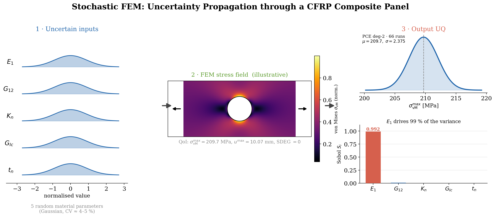
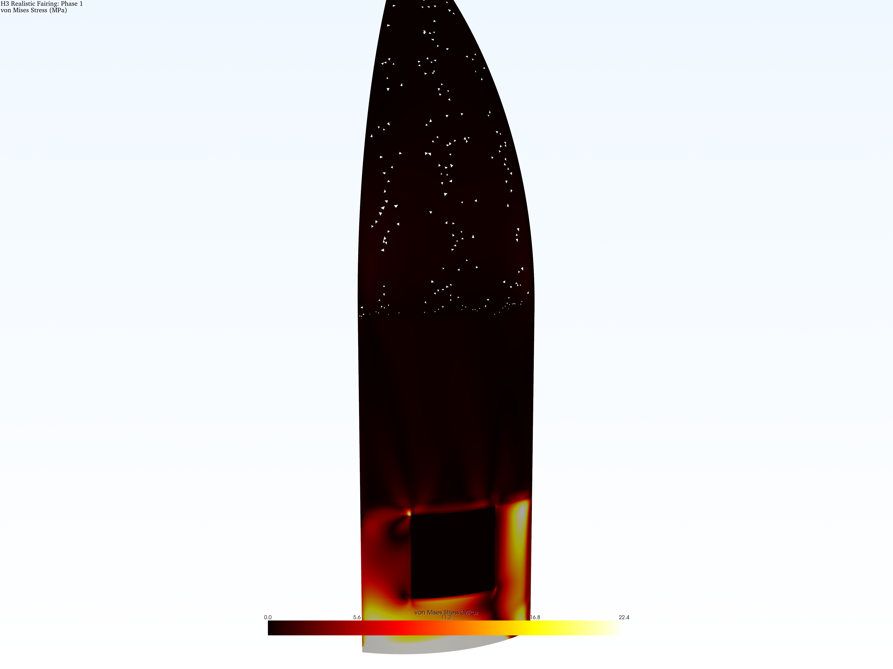
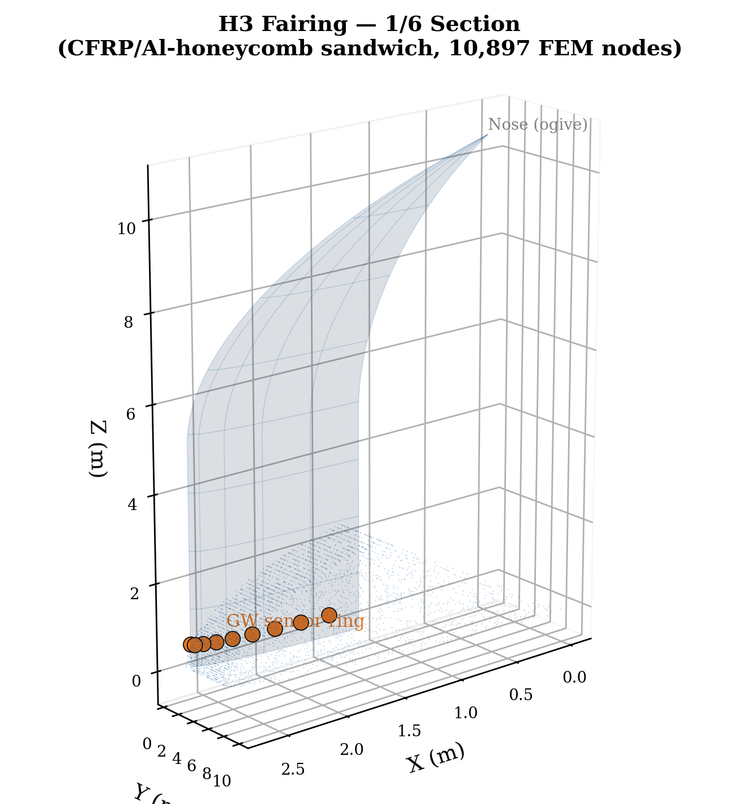

# Stochastic FEM — Uncertainty Quantification of the JAXA H3 Rocket Fairing

**English** | [日本語](README.ja.md)

-blue)


> **Non-intrusive Polynomial Chaos Expansion (PCE) applied to a real aerospace structure:**
> forward uncertainty quantification, Bayesian inverse identification, Karhunen–Loève
> random fields, and a surrogate-model shoot-out — all on a CFRP/Al-honeycomb sandwich
> panel of the JAXA H3 launch-vehicle payload fairing.



---

## Highlights

- **352 Abaqus simulations** orchestrated non-intrusively (Smolyak sparse grids: 66 points for degree 2, 286 for degree 3) — no solver modification required.
- **One parameter rules them all:** the fiber-direction modulus E₁ explains **99.2 %** of the stress variance and **99.95 %** of the displacement variance (first-order Sobol' indices).
- **Zero failures in all 352 runs** (SDEG = 0 everywhere): P_f ≈ 0, reliability index β → ∞ — quantitative evidence of the fairing's conservative design margin.
- **Degree convergence verified:** mean and variance agree to 4 significant digits between PCE degree 2 and 3; leave-one-out RMSE ≈ 10⁻⁴ MPa.
- **Three graded extensions** beyond forward UQ: Bayesian updating (Topic 6), KL random-field modelling (Topic 9), and PCE vs. GP vs. NN surrogate comparison (Topic 13).

## Results at a Glance

| Study | Method | Key result |
|---|---|---|
| **Forward UQ** | PCE deg. 2/3 + Smolyak sparse quadrature | S₁(E₁) = 0.992 for max. von Mises stress; P_f ≈ 0, β → ∞ |
| **Topic 6 — Bayesian inverse** | Conjugate Gaussian update with PCE surrogate likelihood | 10 noisy measurements shrink the posterior std of E₁ from 7 300 to 1 885 MPa (**74 %**) |
| **Topic 9 — Random fields** | Karhunen–Loève expansion, anisotropic exponential kernel | Spatial averaging cuts the effective panel-modulus std from 7 300 to **≈4 700 MPa** — the scalar model is conservative for average-governed responses (input-side result) |
| **Topic 13 — Surrogates** | PCE vs. Gaussian Process vs. Neural Network, N = 10–286 | PCE deg. 2 recovers the smooth response *exactly* (RMSE = 3×10⁻¹³ MPa); NN needs 10× more data |

<p align="center">
  
  
</p>

## Model

**Structure:** CFRP face sheets / aluminium honeycomb core sandwich panel of the JAXA H3 payload fairing, loaded in a representative ascent scenario, solved with **Abaqus/Standard** (cohesive zone modelling for the face-core interface).

**Uncertain parameters** (5 independent log-normal/normal inputs):

| Parameter | Mean | CoV | Description |
|---|---|---|---|
| E₁ | 146 000 MPa | 5 % | Fiber-direction elastic modulus (CFRP) |
| G₁₂ | 5 200 MPa | 10 % | In-plane shear modulus |
| Kₙ | 1 000 N/mm³ | 50 % | Cohesive normal stiffness |
| G_Ic | 0.5 N/mm | 50 % | Mode-I fracture energy |
| tₙ | 50 MPa | 50 % | Cohesive tensile strength |

**Quantities of interest:** maximum von Mises stress, maximum displacement, maximum cohesive damage (SDEG).

## Repository Structure

```
├── report_paper.tex / .pdf          # Main report (LaTeX, ~33 pages incl. appendices)
├── slides_sfem.tex / .pdf           # Presentation slides (Beamer)
├── summary_ja.tex / .pdf            # Japanese summary / 日本語要約
│
├── pce_driver.py                    # PCE orchestration: sparse-grid design → Abaqus jobs
├── extract_pce_qoi.py               # QoI extraction from Abaqus ODB files
├── reliability_analysis.py          # Failure probability / reliability index
├── topic6_bayesian.py               # Topic 6: Bayesian identification of E1
├── topic9_kl_expansion.py           # Topic 9: KL expansion of the E1(x,y) random field
├── topic13_surrogate_comparison.py  # Topic 13: PCE vs GP vs NN convergence study
│
├── make_report_figs.py              # Publication-quality UQ figures
├── generate_figures.py              # Additional visualisation
├── make_visuals.py                  # Hero / pipeline figures
├── thesis_style.py                  # Matplotlib style (LaTeX fonts, LUH column width)
├── figures/                         # All generated figures (+ animation)
│
├── SFEM_2026#*.pdf                  # Lecture notes (Intro … Collocation)
├── SFEM_Exercise_*.pdf              # Exercise sheets + solutions
├── stochastic_fem_cheatsheet.md     # Compact theory reference
└── oral_exam_qa.md                  # Q&A preparation for the oral exam
```

## Reproducing the Post-Processing

The Abaqus ODB files (~293 MB each) live on the LUH compute server; everything downstream of the extracted QoI tables runs locally:

```bash
pip install chaospy numpy scipy matplotlib scikit-learn

python topic6_bayesian.py              # Bayesian update figures
python topic9_kl_expansion.py          # KL eigen-decomposition & sample fields
python topic13_surrogate_comparison.py # Surrogate convergence study
python make_report_figs.py             # Sobol / PDF / convergence plots
```

A TeX Live installation (2025) is required for the LaTeX-rendered figure fonts (`thesis_style.py`) and for building `report_paper.tex`.

## Method in One Paragraph

The response surface u(ξ) is expanded in multivariate orthogonal polynomials of the standardised random inputs ξ, with coefficients computed by **pseudo-spectral projection** on a Smolyak sparse quadrature grid. Because only *input files and output databases* of the FE solver are touched, the approach is fully **non-intrusive** — Abaqus is used as a black box. Statistics (mean, variance), global sensitivities (Sobol' indices), and full output PDFs then follow *analytically* from the PCE coefficients, and the same surrogate powers the Bayesian likelihood evaluations in Topic 6 at negligible cost.

## Course Context

| | |
|---|---|
| **Course** | Stochastic Finite Element Methods, Summer Semester 2026 |
| **Institution** | Leibniz Universität Hannover — Institute of Mechanics and Computational Mechanics (IBNM) |
| **Supervisors** | Prof. Dr.-Ing. Udo Nackenhorst, Dr. Zhibao Zheng |
| **Assessment** | Semester project + report + oral presentation (5 ECTS, graded) |

## License / Disclaimer

Academic coursework. The structural model is a simplified, publicly-informed representation of the H3 fairing created for educational purposes — it is **not** based on proprietary JAXA data.
